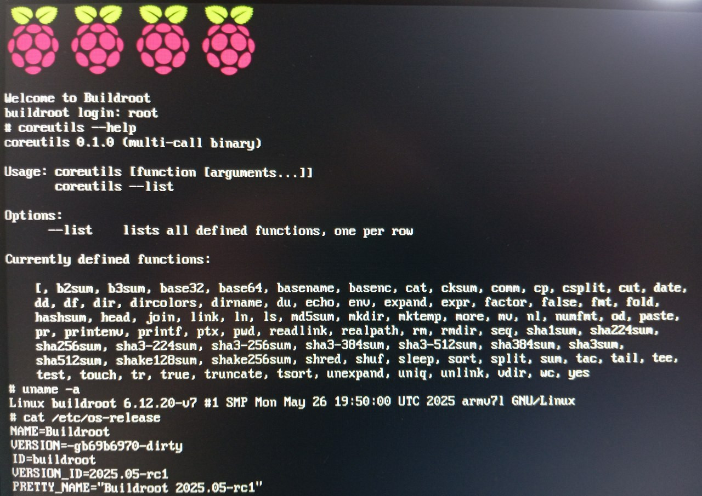

# About

[](https://gitlab.com/alexs-sh/uutils-coreutils-tester/-/commits/master)
[](https://opensource.org/licenses/MIT)

This project provides images with [uutils/coreutils](https://github.com/uutils/coreutils) included. Its main purpose is
to test uutils/coreutils and Buildroot changes on embedded devices and QEMU.
Since Buildroot development is patch-based, all these changes are also available on [Patchwork](https://patchwork.ozlabs.org/project/buildroot/patch/20250527171400.78560-1-shirokovalexs@gmail.com).

## Requirements

Buildroot is used to build the images, so a minimal set of tools such as gcc,
make, and others should be installed. Please refer to the
[Buildroot](https://buildroot.org/downloads/manual/manual.html#requirement)
documentation or check the [Dockerfile](dockerfiles/buildroot.Dockerfile) and/or
[helper script](helpers/prepare-build-host.sh) from the project.


## QEMU

Here is an example of building and running AArch64 images in QEMU.

Build

```
./build-img.sh qemu_aarch64_virt_defconfig
```

Run QEMU with the generated kernel and rootfs.

``` bash
qemu-system-aarch64 -M virt -cpu cortex-a53 -nographic -smp 1 \
    -kernel buildroot/output/images/Image \
    -append "rootwait root=/dev/vda console=ttyAMA0" \
    -netdev user,id=eth0 \
    -device virtio-net-device,netdev=eth0 \
    -drive file=buildroot/output/images/rootfs.ext2,if=none,format=raw,id=hd0 \
    -device virtio-blk-device,drive=hd0
```

Log in as `root` and run the `coreutils` command.

```
Welcome to Buildroot
buildroot login: root

# coreutils --help
coreutils 0.1.0 (multi-call binary)

Usage: coreutils [function [arguments...]]
       coreutils --list

Options:
      --list    lists all defined functions, one per row

Currently defined functions:

    [, b2sum, b3sum, base32, base64, basename, basenc, cat, cksum, comm,
    cp, csplit, cut, date, dd, df, dir, dircolors, dirname, du, echo, env,
    expand, expr, factor, false, fmt, fold, hashsum, head, join, link,
    ln, ls, md5sum, mkdir, mktemp, more, mv, nl, numfmt, od, paste, pr,
    printenv, printf, ptx, pwd, readlink, realpath, rm, rmdir, seq, sha1sum,
    sha224sum, sha256sum, sha3-224sum, sha3-256sum, sha3-384sum, sha3-
    512sum, sha384sum, sha3sum, sha512sum, shake128sum, shake256sum, shred,
    shuf, sleep, sort, split, sum, tac, tail, tee, test, touch, tr, true,
    truncate, tsort, unexpand, uniq, unlink, vdir, wc, yes
```


## Raspberry PI 3

Here is an example of building, flashing and running images for Raspberry Pi 3.

Build

```
./build-img.sh raspberrypi3_defconfig
```

Flash the image to the SD card


``` bash
sudo dd if=buildroot/output/images/sdcard.img of=/dev/sda bs=4M
```

**NOTE**: /dev/sda is used here as an example.Please verify and change the
output (of=/dev/sda) parameter to the appropriate device name.

Insert the SD card into the device, power it on, log in as `root`.


## Orange PI Zero 2W

Build

```
./build-img.sh orangepi_zero2w_defconfig
```

Flash the image to the SD card

``` bash
sudo dd if=buildroot/output/images/sdcard.img of=/dev/sda bs=4M
```

**NOTE**: /dev/sda is used here as an example.Please verify and change the
output (of=/dev/sda) parameter to the appropriate device name.

Insert the SD card into the device, connect the serial port (GND, UART0_TX,
UART0_RX), and power it on. Then wait for it to boot and log in as `root`.

```
Welcome to Orangepi Zero2W
buildroot login: root
# coreutils --help
coreutils 0.1.0 (multi-call binary)

Usage: coreutils [function [arguments...]]
       coreutils --list

Options:
      --list    lists all defined functions, one per row

Currently defined functions:

    [, b2sum, b3sum, base32, base64, basename, basenc, cat, cksum, comm,
    cp, csplit, cut, date, dd, df, dir, dircolors, dirname, du, echo, env,
    expand, expr, factor, false, fmt, fold, hashsum, head, join, link,
    ln, ls, md5sum, mkdir, mktemp, more, mv, nl, numfmt, od, paste, pr,
    printenv, printf, ptx, pwd, readlink, realpath, rm, rmdir, seq, sha1sum,
    sha224sum, sha256sum, sha3-224sum, sha3-256sum, sha3-384sum, sha3-
    512sum, sha384sum, sha3sum, sha512sum, shake128sum, shake256sum, shred,
    shuf, sleep, sort, split, sum, tac, tail, tee, test, touch, tr, true,
    truncate, tsort, unexpand, uniq, unlink, vdir, wc, yes
# cat /etc/os-release
NAME=Buildroot
VERSION=-g83718086-dirty
ID=buildroot
VERSION_ID=2025.05-rc1
PRETTY_NAME="Buildroot 2025.05-rc1"
# uname -a
Linux buildroot 6.12.3 #1 SMP PREEMPT Thu May 29 08:37:21 UTC 2025 aarch64 GNU/Linux
```
